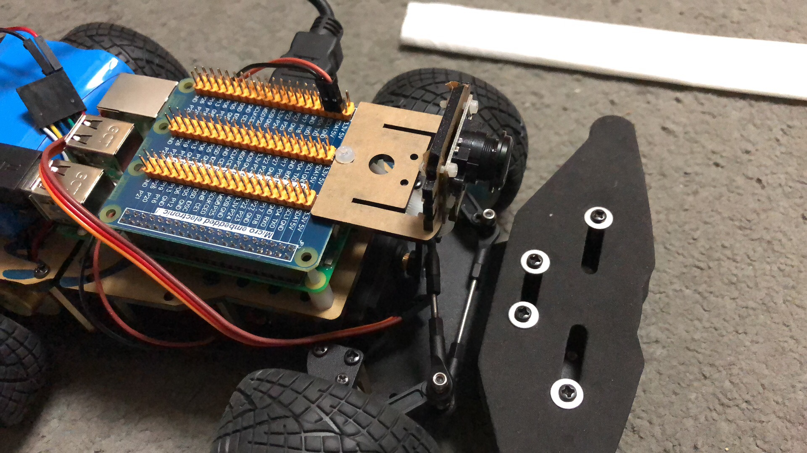

# Prepare

In raspberryPi:

```bash
    cd Tools
    bash change_network.sh wifi
    bash remote_camera.sh
```

In laptop computer:

```bash
conda env create -f=environment.yml --name py2 --debug -v -v
source activate py2
```

# Calibrate the camera

See ```CameraRecalibration.ipynb```. Note I put the camera here:



# Run for lane position and formula

```bash
# change 192.168.1.85:8080 to the raspberry IP:PORT in laneline_coord.py before running this script.
python laneline_coord.py
```

returns:

```bash
(array([  1.36666667e-02,  -2.13888889e+01,   4.20000000e+01, -1.00000000e+00,   1.45800000e+03]), 8.224282026290894)
(array([  1.36666667e-02,  -2.13888889e+01,   4.20000000e+01,  0.00000000e+00,   1.47100000e+03]), 0.5016670227050781)
(array([  1.36666667e-02,  -2.13888889e+01,   4.20000000e+01,  0.00000000e+00,   1.47100000e+03]), 0.5490009784698486)
        ...
(array([  1.36666667e-02,  -2.13888889e+01,   4.20000000e+01,  0.00000000e+00,   1.46900000e+03]), 0.39974021911621094)
```

which means:

- Initiate the first image in 8.22 seconds.
- return array([  1.36666667e-02,  -2.13888889e+01,   4.20000000e+01, -1.00000000e+00,   1.45800000e+03])
  - a = 1.36e-2
  - b = -2.13e1
  - c = 4.2e1
  - d = -1

abcd means 


- For 2nd, 3rd image, one image were processed in 0.50, 0.55 second and returned a np array respectly.
